R Mini Tutorial: R for spatial modelling
================
luiscartor
June 3, 2019

#### Go to [part 1](https://luiscartor.github.io/RMT_part1) of the tutorial.

#### Go to [part 2](https://luiscartor.github.io/RMT_part2) of the tutorial.

<br>

3.1 Raster data
---------------

Rasters are representations of the world that use a grid of equally sized rectangles, normally called cells. In remote sensing or photogrammetry, these cells are known as pixels. Every raster cell has a value associated, representing an average of the value for the area that it covers. Because a raster structure is regular, we do not need a coordinate for every cell, but we need a coordinate reference system (CRS) to situate the regular grid in space. From the CRS and an origin point, we can calculate single cell coordinates by calculating the distance to the origin.

A raster consists on three components: 1) a grid with some dimensions (number of rows and columns), resolution (cell size) and extent (edges of the grid); 2) cell values (typically in the form of a matrix); 3) Projection information (CRS).

Let's load the `raster` library and create a folder to store our spatial data:

``` r
library("raster")  # Loads raster package
```

    ## Loading required package: sp

``` r
if(!file.exists("spatialdata")) dir.create("spatialdata")     # Creates folder to store spatial data
```

### 3.1.2 Creating a raster file

We can create a raster from scratch by defining the three components studied before:

``` r
first_raster <- raster(ncol = 10, nrow = 5, xmn = 0, xmx = 10, ymn = 0, ymx = 5)
first_raster 
```

    ## class      : RasterLayer 
    ## dimensions : 5, 10, 50  (nrow, ncol, ncell)
    ## resolution : 1, 1  (x, y)
    ## extent     : 0, 10, 0, 5  (xmin, xmax, ymin, ymax)
    ## crs        : +proj=longlat +datum=WGS84 +ellps=WGS84 +towgs84=0,0,0

We specified the number of columns and rows, the edges (x and y min and max). We have automatically assigned the resolution (by assigning origins and number of columns and rows). We then have all the parts of the 1st raster component.

Let's now assign some values to the raster:

``` r
values(first_raster) <- runif(ncell(first_raster))     # We assign values random values to the 50 cells
plot(first_raster)                  # plot() works for plotting simple raster maps
```

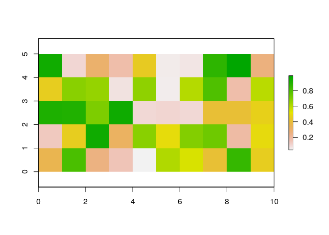

We have assigned random a value to each cell, starting from the top left cell and moving row to row from left to right.

Finally we need to add the third component of a raster, its projection. We use what it is called a proj4 string, which assigns a particular projection using standardized projections codes.

``` r
projection(first_raster) <- "+proj=longlat +datum=WGS84 +ellps=WGS84"

first_raster
```

    ## class      : RasterLayer 
    ## dimensions : 5, 10, 50  (nrow, ncol, ncell)
    ## resolution : 1, 1  (x, y)
    ## extent     : 0, 10, 0, 5  (xmin, xmax, ymin, ymax)
    ## crs        : +proj=longlat +datum=WGS84 +ellps=WGS84 +towgs84=0,0,0 
    ## source     : memory
    ## names      : layer 
    ## values     : 0.0001895148, 0.9980985  (min, max)

### 3.1.3 Download, read, and write raster files

We will download and take a look at bioclimatic variables from worldclim.org. We use `download.file()` to directly download worldclim data, and used `unzip()` to unzip the zipped file:

``` r
# download climate data from worldclim.org
if(!file.exists("spatialdata/bioclim")) dir.create("spatialdata/bioclim")
if( !file.exists( paste0("spatialdata/bioclim/bio_10m_bil.zip")   )){
  utils::download.file(url="http://biogeo.ucdavis.edu/data/climate/worldclim/1_4/grid/cur/bio_10m_bil.zip",
                       destfile="spatialdata/bioclim/bio_10m_bil.zip"   ) 
  utils::unzip("spatialdata/bioclim/bio_10m_bil.zip",exdir="spatialdata/bioclim") 
}
```

Now our downloaded data is in our *spatialdata* folder. We can start reading the data, and write it again to convert it to different file types:

``` r
bioclim1 <- raster("spatialdata/bioclim/bio1.bil")          # Reads raster
if(!file.exists("temp")) dir.create("temp")                                 # Creates a temporal directory
writeRaster(bioclim1,"temp/bio1.bil",overwrite=TRUE)   # We can write the read raster to several formats
writeRaster(bioclim1,"temp/bio1.tiff",overwrite=TRUE)
```

Or we can also read all 19 layers at one time:

``` r
# search files with .bil file extension
clim_list <- list.files("spatialdata/bioclim/",pattern=".bil$",full.names = T)
clim_list
```

    ##  [1] "spatialdata/bioclim//bio1.bil"  "spatialdata/bioclim//bio10.bil"
    ##  [3] "spatialdata/bioclim//bio11.bil" "spatialdata/bioclim//bio12.bil"
    ##  [5] "spatialdata/bioclim//bio13.bil" "spatialdata/bioclim//bio14.bil"
    ##  [7] "spatialdata/bioclim//bio15.bil" "spatialdata/bioclim//bio16.bil"
    ##  [9] "spatialdata/bioclim//bio17.bil" "spatialdata/bioclim//bio18.bil"
    ## [11] "spatialdata/bioclim//bio19.bil" "spatialdata/bioclim//bio2.bil" 
    ## [13] "spatialdata/bioclim//bio3.bil"  "spatialdata/bioclim//bio4.bil" 
    ## [15] "spatialdata/bioclim//bio5.bil"  "spatialdata/bioclim//bio6.bil" 
    ## [17] "spatialdata/bioclim//bio7.bil"  "spatialdata/bioclim//bio8.bil" 
    ## [19] "spatialdata/bioclim//bio9.bil"

The `stack` function allows us to have all layers together in the same raster object:

``` r
# stacking the bioclim variables to process them at one go 
clim <- raster::stack(clim_list) 
```


### 3.1.4 Explore raster data

Let's take a look at the raster information:

``` r
bioclim1 <- raster("spatialdata/bioclim/bio1.bil")
bioclim1
```

    ## class      : RasterLayer 
    ## dimensions : 900, 2160, 1944000  (nrow, ncol, ncell)
    ## resolution : 0.1666667, 0.1666667  (x, y)
    ## extent     : -180, 180, -60, 90  (xmin, xmax, ymin, ymax)
    ## crs        : +proj=longlat +datum=WGS84 +no_defs +ellps=WGS84 +towgs84=0,0,0 
    ## source     : /home/lcarrasco/Documents/teaching/R_MiniTutorial/spatialdata/bioclim/bio1.bil 
    ## names      : bio1 
    ## values     : -269, 314  (min, max)

We can use other commands to access a particular raster information:

``` r
nrow(bioclim1)       # Reads the number of rows
```

    ## [1] 900

``` r
ncol(bioclim1)       # Reads the number of columns
```

    ## [1] 2160

``` r
extent(bioclim1)     # Reads the extent
```

    ## class      : Extent 
    ## xmin       : -180 
    ## xmax       : 180 
    ## ymin       : -60 
    ## ymax       : 90

What is the coordinate reference system?

``` r
crs(bioclim1)
```

    ## CRS arguments:
    ##  +proj=longlat +datum=WGS84 +no_defs +ellps=WGS84 +towgs84=0,0,0

And the resolution?

``` r
res(bioclim1)
```

    ## [1] 0.1666667 0.1666667

The resolution shows the pixel dimensions in lat/long. This is equivalent to about 18x18 squared km.

We will now see the information of the raster stack that we created before:

``` r
clim
```

    ## class      : RasterStack 
    ## dimensions : 900, 2160, 1944000, 19  (nrow, ncol, ncell, nlayers)
    ## resolution : 0.1666667, 0.1666667  (x, y)
    ## extent     : -180, 180, -60, 90  (xmin, xmax, ymin, ymax)
    ## crs        : +proj=longlat +datum=WGS84 +no_defs +ellps=WGS84 +towgs84=0,0,0 
    ## names      :  bio1, bio10, bio11, bio12, bio13, bio14, bio15, bio16, bio17, bio18, bio19,  bio2,  bio3,  bio4,  bio5, ... 
    ## min values :  -269,   -97,  -488,     0,     0,     0,     0,     0,     0,     0,     0,     9,     8,    72,   -59, ... 
    ## max values :   314,   380,   289,  9916,  2088,   652,   261,  5043,  2159,  4001,  3985,   211,    95, 22673,   489, ...

We can see now that the raster stack contains 19 layers. One for each bioclimate variable. All layers have the same CRS, extent and resolution.

We have access to each of these layers by using bracket sub setting:

``` r
clim[[12]]
```

    ## class      : RasterLayer 
    ## dimensions : 900, 2160, 1944000  (nrow, ncol, ncell)
    ## resolution : 0.1666667, 0.1666667  (x, y)
    ## extent     : -180, 180, -60, 90  (xmin, xmax, ymin, ymax)
    ## crs        : +proj=longlat +datum=WGS84 +no_defs +ellps=WGS84 +towgs84=0,0,0 
    ## source     : /home/lcarrasco/Documents/teaching/R_MiniTutorial/spatialdata/bioclim/bio2.bil 
    ## names      : bio2 
    ## values     : 9, 211  (min, max)

``` r
plot(clim[[12]])
```

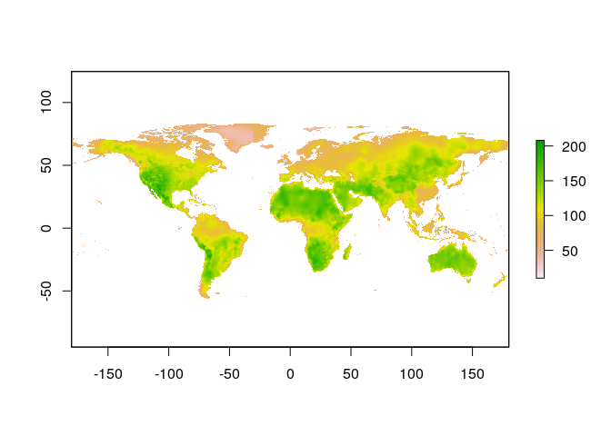

Bioclim variable 12 represents the annual precipitation.

### 3.1.5 Raster manipulation

First, we will try to resample a raster layer. We want the new layer to be 10 times coarser at each axis (i.e., 100 times coarser). In essence, we are resampling the resolution from 10 min to 100 min.

``` r
bioclim1 <- raster("spatialdata/bioclim/bio1.bil")
# define new resolution
newRaster <- raster( nrow= nrow(bioclim1)/10 , ncol= ncol(bioclim1)/10 )
# define the extent of the new coarser resolution raster
extent(newRaster) <- extent(bioclim1)
# fill the new layer with new values
newRaster <- resample(x=bioclim1,y=newRaster,method='bilinear')
# when viewing the new layer, we see that it appears coarser
plot(bioclim1)
```

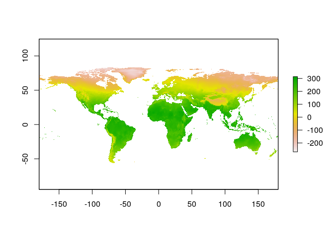

``` r
plot(newRaster) 
```

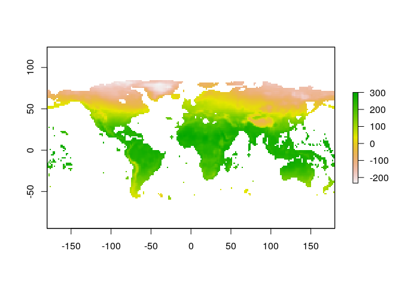 <br>

Now we will reclassify a raster layer as a binary layer: areas that are higher than 100 vs. areas that are lower than 100.

``` r
bioclim1 <- raster("spatialdata/bioclim/bio1.bil")

binaryMap <-   bioclim1>= 100
plot(binaryMap)
```

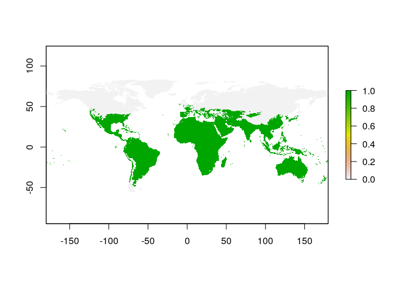

Use can also use multiple thresholds to reclassify:

``` r
# values smaller than 0 becomes 0; 
# values between 0 and 100 becomes 1; 
# values between 100 and 200 becomes 2;
# values larger than 200 becomes 3;
myMethod <- c(-Inf,  0, 0, # from, to, new value
              0,   100, 1,
              100, 200, 2,
              200, Inf, 3)
myLayer_classified <- reclassify(bioclim1,rcl= myMethod)
plot(myLayer_classified)
```

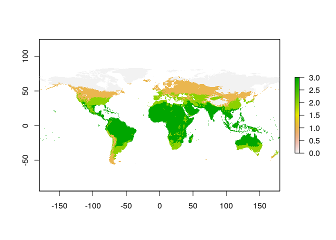

<br>

Let's do now some operations with rasters. We will use the precipitation layers from bioclim:

``` r
wet <- raster("spatialdata/bioclim/bio13.bil") # precipitation of wettest month
dry <- raster("spatialdata/bioclim/bio14.bil") # precipitation of driest month

# To calculate difference between these two rasters
diff <- wet - dry
names(diff) <- "diff"
diff
```

    ## class      : RasterLayer 
    ## dimensions : 900, 2160, 1944000  (nrow, ncol, ncell)
    ## resolution : 0.1666667, 0.1666667  (x, y)
    ## extent     : -180, 180, -60, 90  (xmin, xmax, ymin, ymax)
    ## crs        : +proj=longlat +datum=WGS84 +no_defs +ellps=WGS84 +towgs84=0,0,0 
    ## source     : memory
    ## names      : diff 
    ## values     : 0, 2088  (min, max)

We can see that the new layer is also a raster. We can also make operations between the layers of a stack file:

``` r
# To calculate the mean between the dry and wet rasters
twoLayers <- stack(wet,dry)
meanPPT1 <- calc(twoLayers,fun=mean)
names(meanPPT1) <- "mean"

# The following code gives the same results
meanPPT2 <-  (wet + dry)/2
names(meanPPT2) <- "mean"
layers_to_plot <- stack(wet, dry, diff, meanPPT1,meanPPT2)
plot(layers_to_plot)
```

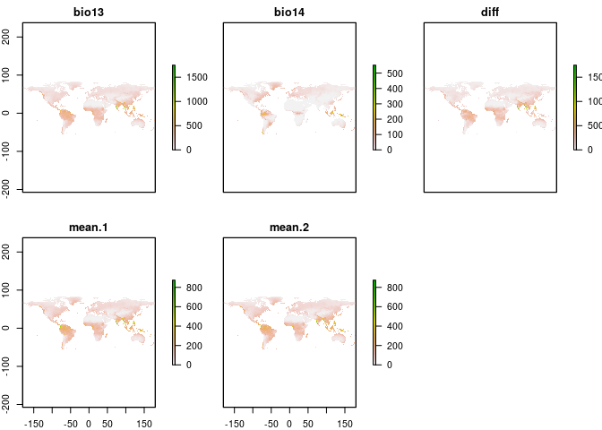

<br>

Now we will calculate the correlation between raster layers:

``` r
# search files with *.bil* file extension
clim_list <- list.files("spatialdata/bioclim/",pattern=".bil$",full.names = T)
# stacking the bioclim variables to process them at one go 
clim <- raster::stack(clim_list) 
# select the first 5 layers
clim_subset <- clim[[1:5]]
# to run correlations between different layers
raster::pairs(clim_subset,maxpixels=1000) # the default is maxpixels=100000
```

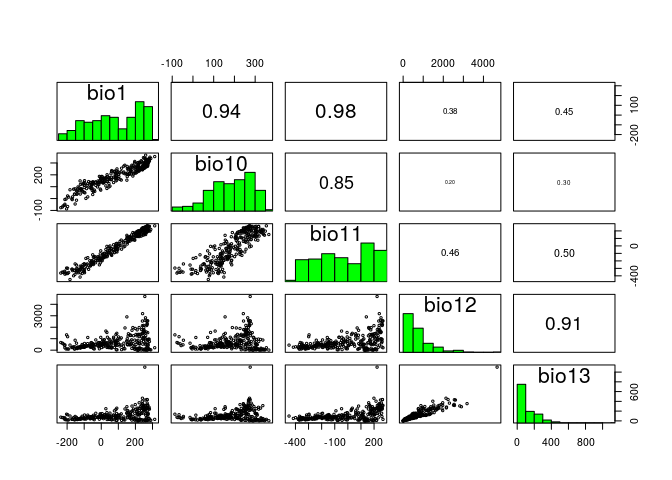

The `pairs()` function from the `raster` package pairs plots of layers and calculates correlations between layers' data.

<br>

> ### Excercise
>
> Download and process worldclim data: 1) download worldclim\_V1.4 10m resolution bioclimatic layers
> 2) read BIO5 (Max Temperature of Warmest Month) & BIO6 (Min Temperature of Coldest Month)
> 3) calculate the `difference` between the two layers and plot the result. 4) save the `difference` as `difference.tiff` in folder `temp`

<br>

3.2 Vector data
---------------

In order to deal with vectorial spatial data in R, we need to be familiar with the `sp` package. `sp` provides a set of data types, or *classes* to represent spatial data. The `sp` package does not provide many functions to analyze spatial data. However, many other important packages use the `sp` classes.

We saw that there are three main types of vector data: points, lines, and polygons. For these, the `sp` package defines the classes: `SpatialPoints`, `SpatialLines`, `SpatialPolygons`. We are going to study how to work with these data types.

Please load these libraries that we previously installed:

``` r
library("sp")
library("raster")
library("dismo")
library("rgeos")
library("rgdal")
```

### 3.2.1 Points

Let's create our own spatial points:

``` r
longitude <- c(-116.7, -120.4, -116.7, -113.5, -115.5, -120.8, -119.5, -113.7, -113.7, -110.7)
latitude <- c(45.3, 42.6, 38.9, 42.1, 35.7, 38.9, 36.2, 39, 41.6, 36.9)
lonlat <- cbind(longitude, latitude)
```

So far, we have just created a matrix with lat/long coordinates. Now, we need to convert this values into a spatial object:

``` r
pts <- SpatialPoints(lonlat)
pts
```

    ## class       : SpatialPoints 
    ## features    : 10 
    ## extent      : -120.8, -110.7, 35.7, 45.3  (xmin, xmax, ymin, ymax)
    ## crs         : NA

Check what type of object pts is. Now we want to check what information is stored in that object:

``` r
showDefault(pts)
```

    ## An object of class "SpatialPoints"
    ## Slot "coords":
    ##       longitude latitude
    ##  [1,]    -116.7     45.3
    ##  [2,]    -120.4     42.6
    ##  [3,]    -116.7     38.9
    ##  [4,]    -113.5     42.1
    ##  [5,]    -115.5     35.7
    ##  [6,]    -120.8     38.9
    ##  [7,]    -119.5     36.2
    ##  [8,]    -113.7     39.0
    ##  [9,]    -113.7     41.6
    ## [10,]    -110.7     36.9
    ## 
    ## Slot "bbox":
    ##              min    max
    ## longitude -120.8 -110.7
    ## latitude    35.7   45.3
    ## 
    ## Slot "proj4string":
    ## CRS arguments: NA

We can see that there is no CRS associated with the coordinates yet. Let's create the object again, but providing a coordinate system:

``` r
crdref <- CRS('+proj=longlat +datum=WGS84')
pts <- SpatialPoints(lonlat, proj4string=crdref)
pts
```

    ## class       : SpatialPoints 
    ## features    : 10 
    ## extent      : -120.8, -110.7, 35.7, 45.3  (xmin, xmax, ymin, ymax)
    ## crs         : +proj=longlat +datum=WGS84 +ellps=WGS84 +towgs84=0,0,0

What we will do next is important. We have created a SpatialPoints object. But each point of the object does not have any information associated. To be able to add information to the object and to be able to do calculations with it we need to create a `SpatialPointsDataFrame` object.

To do that, we first create a `data.frame` with the same number of rows as the previous coordinates:

``` r
# Generate random precipitation values, same quantity as points
precipvalue <- runif(nrow(lonlat), min=0, max=100)
df <- data.frame(ID=1:nrow(lonlat), precip=precipvalue)
df
```

    ##    ID    precip
    ## 1   1 72.068660
    ## 2   2  8.737482
    ## 3   3 22.752216
    ## 4   4 56.740672
    ## 5   5 72.897111
    ## 6   6 52.099820
    ## 7   7 57.444315
    ## 8   8 24.494930
    ## 9   9 74.450572
    ## 10 10 89.294353

And now we add the precipitation values to the spatial points we created before:

``` r
ptsdf <- SpatialPointsDataFrame(pts, data=df)
ptsdf
```

    ## class       : SpatialPointsDataFrame 
    ## features    : 10 
    ## extent      : -120.8, -110.7, 35.7, 45.3  (xmin, xmax, ymin, ymax)
    ## crs         : +proj=longlat +datum=WGS84 +ellps=WGS84 +towgs84=0,0,0 
    ## variables   : 2
    ## names       : ID,           precip 
    ## min values  :  1, 8.73748199082911 
    ## max values  : 10, 89.2943528247997

See what is inside this `SpatialPointsDataFrame`:

``` r
showDefault(ptsdf)
```

    ## An object of class "SpatialPointsDataFrame"
    ## Slot "data":
    ##    ID    precip
    ## 1   1 72.068660
    ## 2   2  8.737482
    ## 3   3 22.752216
    ## 4   4 56.740672
    ## 5   5 72.897111
    ## 6   6 52.099820
    ## 7   7 57.444315
    ## 8   8 24.494930
    ## 9   9 74.450572
    ## 10 10 89.294353
    ## 
    ## Slot "coords.nrs":
    ## numeric(0)
    ## 
    ## Slot "coords":
    ##       longitude latitude
    ##  [1,]    -116.7     45.3
    ##  [2,]    -120.4     42.6
    ##  [3,]    -116.7     38.9
    ##  [4,]    -113.5     42.1
    ##  [5,]    -115.5     35.7
    ##  [6,]    -120.8     38.9
    ##  [7,]    -119.5     36.2
    ##  [8,]    -113.7     39.0
    ##  [9,]    -113.7     41.6
    ## [10,]    -110.7     36.9
    ## 
    ## Slot "bbox":
    ##              min    max
    ## longitude -120.8 -110.7
    ## latitude    35.7   45.3
    ## 
    ## Slot "proj4string":
    ## CRS arguments:
    ##  +proj=longlat +datum=WGS84 +ellps=WGS84 +towgs84=0,0,0

Now we can plot our points:

``` r
plot(ptsdf, axes=TRUE, las=1)
```

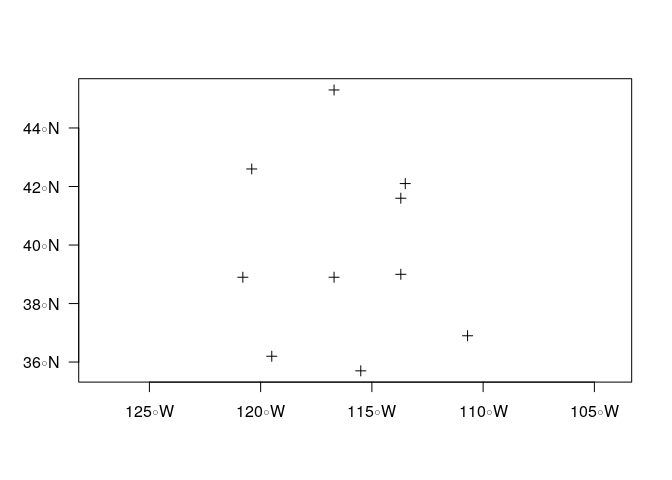

Not a very fancy map yet. But we will improve it later.

<br>

### 3.2.2 Lines and polygons

Now we will focus on spatial lines and polygons. These objects are more complex than a `SpatialPoint`. But we can easily create lines and polygons using the `spLines` and `spPolygons` functions from the raster package. Let's create a `SpatialLines` object:

``` r
lon <- c(-116.8, -114.2, -112.9, -111.9, -114.2, -115.4, -117.7)
lat <- c(41.3, 42.9, 42.4, 39.8, 37.6, 38.3, 37.6)
lonlat <- cbind(lon, lat)
lns <- spLines(lonlat, crs=crdref)
lns
```

    ## class       : SpatialLines 
    ## features    : 1 
    ## extent      : -117.7, -111.9, 37.6, 42.9  (xmin, xmax, ymin, ymax)
    ## crs         : +proj=longlat +datum=WGS84 +ellps=WGS84 +towgs84=0,0,0

We can see how this object looks like:

``` r
plot(lns,axes=TRUE, las=1)
```

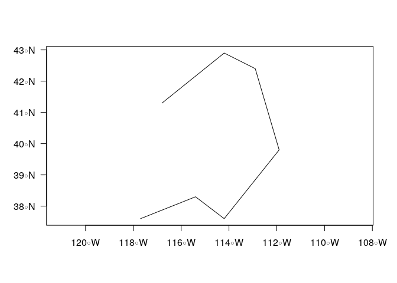

We can use the same coordinates to create a `SpatialPolygon` object:

``` r
pols <- spPolygons(lonlat, crs=crdref)
pols
```

    ## class       : SpatialPolygons 
    ## features    : 1 
    ## extent      : -117.7, -111.9, 37.6, 42.9  (xmin, xmax, ymin, ymax)
    ## crs         : +proj=longlat +datum=WGS84 +ellps=WGS84 +towgs84=0,0,0

Now we can plot this polygon, together with our spatial points:

``` r
plot(pols, axes=TRUE, las=1)
plot(pols, border='blue', col='orange', lwd=3, add=TRUE)
points(pts, col='red', pch=20, cex=3)
```

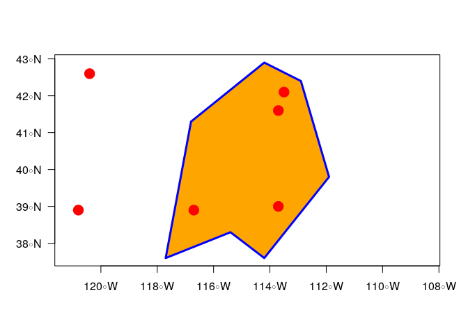

Let's create two more polygon coordinates:

``` r
lonlat2 <- cbind(c(-118.0,-121.8,-117.9,-117.7),c(38.2,40.3,42.1,39.2))
lonlat3 <- cbind(c(-112.0,-111.0,-112.1,-108.1,-108.1),c(38.3,40.0,42.3,42.3,38.0))
```

Now we can create an object that contains the three created polygons:

``` r
threepols <- spPolygons(lonlat,lonlat2,lonlat3,crs=crdref)
threepols
```

    ## class       : SpatialPolygons 
    ## features    : 3 
    ## extent      : -121.8, -108.1, 37.6, 42.9  (xmin, xmax, ymin, ymax)
    ## crs         : +proj=longlat +datum=WGS84 +ellps=WGS84 +towgs84=0,0,0

Let's plot them:

``` r
plot(threepols, axes=TRUE, las=1)
plot(threepols, border='blue', col='orange', lwd=3, add=TRUE)
points(pts, col='red', pch=20, cex=3)
```

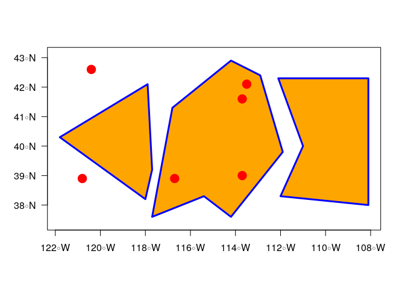

### 3.2.3 Manipulation of vector data

Now we are going to learn how to manipulate points, lines and polygons. First, we will add attribute data to our three polygons:

``` r
attr <- data.frame(attr1 = 1:3, attr2 = 7:5)

threepolsdf <- SpatialPolygonsDataFrame(threepols, attr)
threepolsdf
```

    ## class       : SpatialPolygonsDataFrame 
    ## features    : 3 
    ## extent      : -121.8, -108.1, 37.6, 42.9  (xmin, xmax, ymin, ymax)
    ## crs         : +proj=longlat +datum=WGS84 +ellps=WGS84 +towgs84=0,0,0 
    ## variables   : 2
    ## names       : attr1, attr2 
    ## min values  :     1,     5 
    ## max values  :     3,     7

Now we have a `SpatialPolygonsDataFrame` object and we can play with it.

We can extract just the attributes (ignoring the spatial aspects) and create a data frame:

``` r
d <- data.frame(threepolsdf)
d
```

    ##   attr1 attr2
    ## 1     1     7
    ## 2     2     6
    ## 3     3     5

Or the opposite, extract the geometry:

``` r
g <- geom(threepolsdf)
g
```

    ##       object part cump hole      x    y
    ##  [1,]      1    1    1    0 -116.8 41.3
    ##  [2,]      1    1    1    0 -114.2 42.9
    ##  [3,]      1    1    1    0 -112.9 42.4
    ##  [4,]      1    1    1    0 -111.9 39.8
    ##  [5,]      1    1    1    0 -114.2 37.6
    ##  [6,]      1    1    1    0 -115.4 38.3
    ##  [7,]      1    1    1    0 -117.7 37.6
    ##  [8,]      1    1    1    0 -116.8 41.3
    ##  [9,]      2    1    2    0 -118.0 38.2
    ## [10,]      2    1    2    0 -121.8 40.3
    ## [11,]      2    1    2    0 -117.9 42.1
    ## [12,]      2    1    2    0 -117.7 39.2
    ## [13,]      2    1    2    0 -118.0 38.2
    ## [14,]      3    1    3    0 -112.0 38.3
    ## [15,]      3    1    3    0 -111.0 40.0
    ## [16,]      3    1    3    0 -112.1 42.3
    ## [17,]      3    1    3    0 -108.1 42.3
    ## [18,]      3    1    3    0 -108.1 38.0
    ## [19,]      3    1    3    0 -112.0 38.3

We can subset and extract only one of the variables:

``` r
threepolsdf$attr2    # Extract variable attr2
```

    ## [1] 7 6 5

``` r
threepolsdf[ ,"attr1"]   # Subset variable 1: a spatial polygon is returned with only one variable
```

    ## class       : SpatialPolygonsDataFrame 
    ## features    : 3 
    ## extent      : -121.8, -108.1, 37.6, 42.9  (xmin, xmax, ymin, ymax)
    ## crs         : +proj=longlat +datum=WGS84 +ellps=WGS84 +towgs84=0,0,0 
    ## variables   : 1
    ## names       : attr1 
    ## min values  :     1 
    ## max values  :     3

We can also add a new variable:

``` r
threepolsdf$newatt <- sample(letters, 3)   # We add a new variables with random letters
d <- data.frame(threepolsdf)
d
```

    ##   attr1 attr2 newatt
    ## 1     1     7      l
    ## 2     2     6      i
    ## 3     3     5      q

Let's plot only one of the polygons:

``` r
plot(threepolsdf[2,], axes=TRUE, las=1)
plot(threepolsdf[2,], border='blue', col='orange', lwd=3, add=TRUE)
```

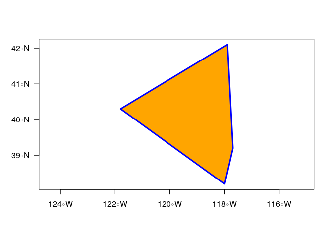

<br>

> ### Excercise
>
> 1.  Use three-polygons object that we just created and add a new attribute called `heron_pop` and give it some values.
> 2.  Create a new spatial point object with points that fall inside our three polygons. Then plot the polygons and the new created points together.

<br>

3.3 Spatial analysis
--------------------

In this last section, we are going to use species occurrences and climate data to perform some spatial data analysis.

### 3.3.1 Download and manipulate species occurences

We are going to use an API (application programming interface) called GBFI, through the `dismo` package, in order to download species occurrences. Let's check how many occurrences we can obtain for the california condor (*Gymnogyps californianus*).

``` r
library(dismo)
condor <- gbif(genus="Gymnogyps",species="californianus",download=FALSE)
```

    ## Loading required namespace: jsonlite

``` r
condor
```

    ## [1] 10791

We set `download=TRUE` to download the data to our spatialdata folder:

``` r
if(!file.exists("spatialdata/condor_raw.rdata")){
  occ_raw <- gbif(genus="Gymnogyps",species="californianus",download=TRUE) 
  save(occ_raw,file = "spatialdata/condor_raw.rdata")
}else{
  load("spatialdata/condor_raw.rdata")
}

head(occ_raw)      # View the first condor occurence records from the dataset
```

Let's take a look at the attributes of the data set table:

``` r
names(occ_raw) [1:20 ]
```

    ##  [1] "acceptedNameUsage"             "acceptedScientificName"       
    ##  [3] "acceptedTaxonKey"              "accessRights"                 
    ##  [5] "adm1"                          "adm2"                         
    ##  [7] "associatedReferences"          "associatedSequences"          
    ##  [9] "basisOfRecord"                 "behavior"                     
    ## [11] "bibliographicCitation"         "catalogNumber"                
    ## [13] "class"                         "classKey"                     
    ## [15] "cloc"                          "collectionCode"               
    ## [17] "collectionID"                  "continent"                    
    ## [19] "coordinatePrecision"           "coordinateUncertaintyInMeters"

The meaning of those columns/terms are defined by Darwin Core. Refer to [Darwin Core quick reference guide](https://dwc.tdwg.org/terms/) for more information.

A few columns to highlight:

-   `basisOfRecord`
-   The specific nature of the data record.
-   PreservedSpecimen, FossilSpecimen, LivingSpecimen, MaterialSample, Event, HumanObservation, MachineObservation, Taxon, Occurrence

-   `year`
-   The four-digit year in which the Event occurred, according to the Common Era Calendar.

-   `lat` and `lon` (or `decimalLongitude`,`decimalLatitude` in Darwin Core)
-   The geographic longitude/latitude of the geographic center of a Location. Positive values are east of the Greenwich Meridian/north of the Equator, negative values are west/south of it. Legal values lie between \[-180 180\] / \[-90 90\], inclusive.

<br>

Now we want to clean this dataset. Data cleaning is a fundamental step in any project that involves externally collected, big datasets. For occurrence data, we need to remove entries with not appropriate coordinates or missing location data. We create a new dataset, `occ_clean`, subsetting the raw dataset with records with appropriate latitude/longitude data:

``` r
# here we remove erroneous coordinates, where either the latitude or longitude is missing
occ_clean <- subset(occ_raw,(!is.na(lat))&(!is.na(lon))) 
#  is.na selects the no-data values

#Show the number of records that are removed from the dataset.  
cat(nrow(occ_raw)-nrow(occ_clean), "records are removed")
```

    ## 355 records are removed

The function `subset()` help us select the rows that fulfill some condition. Now we want to remove records with duplicated location data:

``` r
dups <- duplicated( occ_clean[c("lat","lon")]  )
occ_unique <- occ_clean[!dups,]
cat(nrow(occ_clean)-nrow(occ_unique), "records are removed")
```

    ## 7731 records are removed

The function `duplicated()` helps us subset the rows that have duplicated values for the selected columns. Now let's take a look at the column "basisOfRecord". We can use the function `table()` to summarize the type of records:

``` r
table(occ_unique$basisOfRecord)
```

    ## 
    ##     FOSSIL_SPECIMEN   HUMAN_OBSERVATION MACHINE_OBSERVATION 
    ##                  27                2519                   1 
    ##         OBSERVATION  PRESERVED_SPECIMEN             UNKNOWN 
    ##                   7                 150                   1

Let's keep only the records associated with human observations:

``` r
occ_observed <- subset(occ_unique, basisOfRecord=="HUMAN_OBSERVATION")
cat(nrow(occ_observed), "out of ", nrow(occ_unique), "records are observed")
```

    ## 2519 out of  2705 records are observed

Now let's filter the data by year record:

``` r
occ_final <- subset(occ_observed, year>=2000 & year <=2018)
summary(occ_final$year)
```

    ##    Min. 1st Qu.  Median    Mean 3rd Qu.    Max. 
    ##    2000    2012    2015    2014    2017    2018

Finally, lets convert this dataset into a spatial dataset.

``` r
occ_spatial <- occ_final                    # Duplicate the dataset
coordinates(occ_spatial) <- ~ lon + lat     # Converts the data frame into a spatial data frame assigning lon lat to coordinates

class(occ_final)
```

    ## [1] "data.frame"

``` r
class(occ_spatial)
```

    ## [1] "SpatialPointsDataFrame"
    ## attr(,"package")
    ## [1] "sp"

Let's see what CRS is assigned to this spatial dataset:

``` r
crs(occ_spatial)
```

    ## CRS arguments: NA

We haven't assigned any CRS to the dataset. Let's define CRS objects:

``` r
# Define the coordinate system that will be used. Here we show several examples:
myCRS1 <- CRS("+init=epsg:4326") # WGS 84
myCRS2 <- CRS("+init=epsg:4269") # NAD 83
myCRS3 <- CRS("+init=epsg:3857") # Mercator
myCRS3 <- CRS("+init=epsg:3413") # WGS 84 / NSIDC Sea Ice Polar Stereographic North
```


Now we assign the CRS to our occurrence spatial object:

``` r
crs(occ_spatial) <- myCRS1
crs(occ_spatial)
```

    ## CRS arguments:
    ##  +init=epsg:4326 +proj=longlat +datum=WGS84 +no_defs +ellps=WGS84
    ## +towgs84=0,0,0

And we can even transform the projection to other CRS:

``` r
occ_spatial_projected <- spTransform(occ_spatial, myCRS3)
plot(occ_spatial)
```

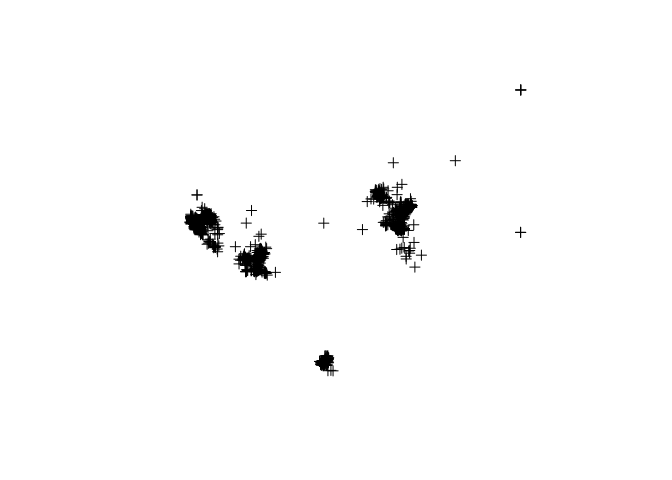

``` r
plot(occ_spatial_projected)
```

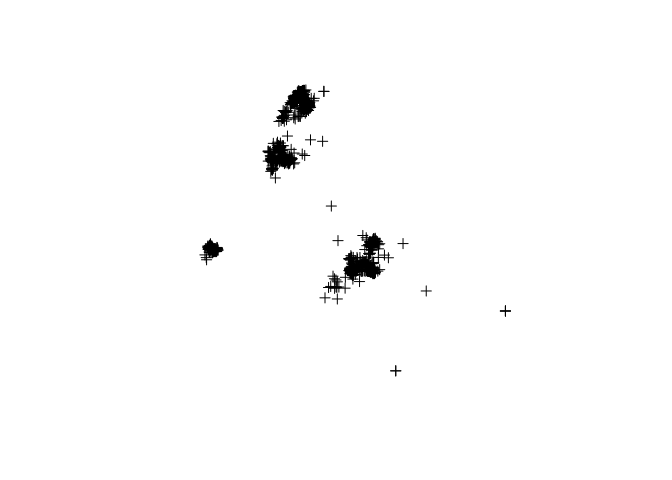

Finally we can save our spatial data as a shapefile:

``` r
if(!file.exists("temp")) dir.create("temp")
shapefile(occ_spatial,"temp/occ_spatial.shp",overwrite=TRUE)
loaded_shapefile <- shapefile("temp/occ_spatial.shp")
```

Now we can open the shapefile with other GIS software, such as QGIS or ArcGis.

<br>

> ### Excercise
>
> Select your favourite species (select one with no more than 200000 records!) and: 1) keep specimen records only; 2) subset to records from 1990 to 2000; 3) clean the dataset; 4) make the dataset spatial, assign a CRS, plot, and save the dataset.

<br>

### 3.3.2 Combining vector and raster data

Let's combine our occurrence data of california condor with the bioclim data:

``` r
if( !file.exists( paste0("spatialdata/bioclim/bio_10m_bil.zip")   )){
  utils::download.file(url="http://biogeo.ucdavis.edu/data/climate/worldclim/1_4/grid/cur/bio_10m_bil.zip",
                       destfile="spatialdata/bioclim/bio_10m_bil.zip"   ) 
  utils::unzip("spatialdata/bioclim/bio_10m_bil.zip",exdir="spatialdata/bioclim") 
}

bio1 <- raster("spatialdata/bioclim/bio1.bil")
```

Plot the occurrence dataset and the raster layer together:

``` r
plot(bio1)
plot(occ_spatial,add=T)
```

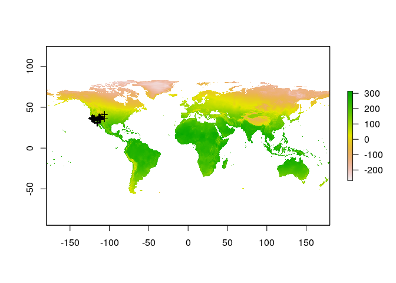

We are able now to extract environmental conditions for the californian condor locations. We will use the `extract()` function to obtain the raster values at the point locations:

``` r
# load bioclimatic layers
clim_list <- list.files("spatialdata/bioclim/",pattern=".bil$",full.names = T)
clim <- raster::stack(clim_list) 

conditions_occ <- extract(clim,occ_spatial)
head(conditions_occ)
```

    ##      bio1 bio10 bio11 bio12 bio13 bio14 bio15 bio16 bio17 bio18 bio19 bio2
    ## [1,]   74   175   -17   434    53    15    30   135    63   113   123  154
    ## [2,]  144   199    92   372    68     1    85   199     5    11   191  169
    ## [3,]  144   211    83   378    69     1    85   201     5    12   193  187
    ## [4,]  121   206    50   378    66     2    79   188    11    19   182  129
    ## [5,]  101   204     5   394    45    13    28   128    62    89   117  166
    ## [6,]  131   159   103   692   135     1    90   369     5    10   369  123
    ##      bio3 bio4 bio5 bio6 bio7 bio8 bio9
    ## [1,]   41 7564  276  -91  367   -7  104
    ## [2,]   58 4239  303   15  288   99  196
    ## [3,]   55 5092  336    2  334   91  210
    ## [4,]   42 6268  295   -6  301   55  204
    ## [5,]   42 7828  313  -76  389   18  132
    ## [6,]   64 2289  230   39  191  103  154

We can check if the dataset contains NA values:

``` r
bad_records <- is.na( conditions_occ[,1] ) 
table(bad_records)
```

    ## bad_records
    ## FALSE  TRUE 
    ##  2337     1

We do have one NA value, so we want to remove it:

``` r
conditions_occ[bad_records,]
```

    ##  bio1 bio10 bio11 bio12 bio13 bio14 bio15 bio16 bio17 bio18 bio19  bio2 
    ##    NA    NA    NA    NA    NA    NA    NA    NA    NA    NA    NA    NA 
    ##  bio3  bio4  bio5  bio6  bio7  bio8  bio9 
    ##    NA    NA    NA    NA    NA    NA    NA

``` r
occ_spatial <- occ_spatial[!bad_records,]
```

We can clip the raster so that we can visualize only our area of interest. We use the `crop()` function from the `raster` package.

``` r
bio1 <- raster("spatialdata/bioclim/bio1.bil")

mybox <- extent(-130,   -100,     25,    45)
              #min x, max x, min y, max y
bio1_crop <- crop(bio1, mybox)

plot(bio1_crop)
plot(occ_spatial,add=T)
```

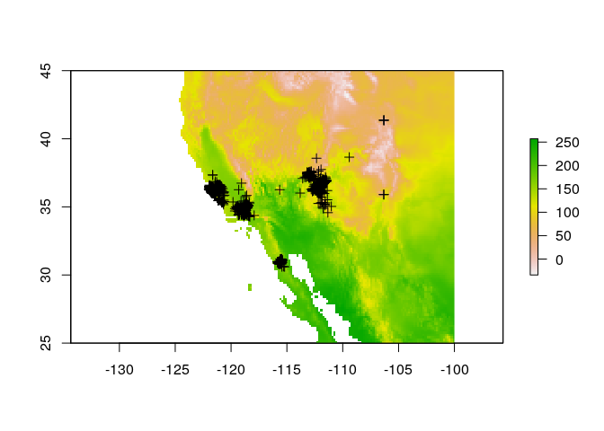

### 3.3.3 Model creation and fitting

We are going to create a simplistic distribution model. We create random theoretical absences in our map. Then we will compare the occurrences with the absences to predict the environmental niche of the species.

We create absences or *background samples*:

``` r
set.seed(1)                         # We use set.seed() before sampling to guarantee same random sample every repetition
bg <- sampleRandom(x=clim,
                   size=1000,
                   na.rm=T, #removes the 'Not Applicable' points  
                   sp=T) # return spatial points 

head(bg)
```

    ##   bio1 bio10 bio11 bio12 bio13 bio14 bio15 bio16 bio17 bio18 bio19 bio2
    ## 1  247   252   241  1709   232    32    43   625   142   357   564  110
    ## 2 -196    61  -454   333    74     8    75   184    31   184    35  119
    ## 3  262   270   248  1427   244    11    69   672    52   333    87  122
    ## 4  140   241    28   378    58     7    53   151    28   103   113  141
    ## 5  217   288   134   254    33    10    39    96    33    94    39  144
    ## 6  273   315   214   583   151     2   108   384    12   285    12  143
    ##   bio3  bio4 bio5 bio6 bio7 bio8 bio9
    ## 1   81   452  320  185  135  243  247
    ## 2   18 20509  151 -505  656   61 -416
    ## 3   70   906  347  175  172  266  251
    ## 4   37  8282  314  -58  372   87  148
    ## 5   45  6048  370   55  315  282  153
    ## 6   53  4050  389  122  267  310  214

And can also use the `extract()` function to get the environmental conditions for the background sample:

``` r
conditions_bg<- extract(clim,bg)
head(conditions_bg)
```

    ##      bio1 bio10 bio11 bio12 bio13 bio14 bio15 bio16 bio17 bio18 bio19 bio2
    ## [1,]  247   252   241  1709   232    32    43   625   142   357   564  110
    ## [2,] -196    61  -454   333    74     8    75   184    31   184    35  119
    ## [3,]  262   270   248  1427   244    11    69   672    52   333    87  122
    ## [4,]  140   241    28   378    58     7    53   151    28   103   113  141
    ## [5,]  217   288   134   254    33    10    39    96    33    94    39  144
    ## [6,]  273   315   214   583   151     2   108   384    12   285    12  143
    ##      bio3  bio4 bio5 bio6 bio7 bio8 bio9
    ## [1,]   81   452  320  185  135  243  247
    ## [2,]   18 20509  151 -505  656   61 -416
    ## [3,]   70   906  347  175  172  266  251
    ## [4,]   37  8282  314  -58  372   87  148
    ## [5,]   45  6048  370   55  315  282  153
    ## [6,]   53  4050  389  122  267  310  214

Now we plot the occurrences and the absences:

``` r
plot(bio1_crop[[1]])
# add the background points to the plotted raster
plot(bg,add=T,col="black") 
# add the occurrence data to the plotted raster
plot(occ_spatial,add=T,col="red")
```

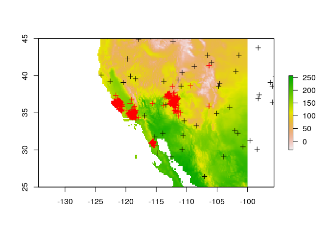

Now we separate the occurrence and background data into training and testing data using a kfold method:

``` r
set.seed(1)
group <- kfold(conditions_occ, 5)
occ_train <- conditions_occ[group != 1, ]
occ_test <- conditions_occ[group == 1, ]

group <- kfold(bg, 5)
bg_train <- conditions_bg[group != 1, ]
bg_test <- conditions_bg[group == 1, ]
```

We can now fit a logistic regression model (using the `glm()` function) using the training data.

``` r
train <- data.frame(rbind(occ_train, bg_train))
train$pa <- c(rep(1, nrow(occ_train)), rep(0, nrow(bg_train)))  # We create presence or absece column


condorglm <- glm(pa ~ bio1 + bio5 + bio6 + bio7 + bio8 + bio12 + bio16 + bio17,   # We can choose the predictive variables
            family = binomial(link = "logit"), data=train)    # GLM family argument (logit/identity/log)
summary(condorglm)
```

    ## 
    ## Call:
    ## glm(formula = pa ~ bio1 + bio5 + bio6 + bio7 + bio8 + bio12 + 
    ##     bio16 + bio17, family = binomial(link = "logit"), data = train)
    ## 
    ## Deviance Residuals: 
    ##     Min       1Q   Median       3Q      Max  
    ## -4.2331  -0.0049   0.1221   0.4316   2.7470  
    ## 
    ## Coefficients: (1 not defined because of singularities)
    ##              Estimate Std. Error z value Pr(>|z|)    
    ## (Intercept)  4.945179   0.802798   6.160 7.28e-10 ***
    ## bio1        -0.384784   0.023394 -16.448  < 2e-16 ***
    ## bio5         0.176459   0.010562  16.707  < 2e-16 ***
    ## bio6         0.220200   0.013320  16.531  < 2e-16 ***
    ## bio7               NA         NA      NA       NA    
    ## bio8        -0.004844   0.001372  -3.530 0.000416 ***
    ## bio12        0.012102   0.002408   5.025 5.04e-07 ***
    ## bio16       -0.026644   0.004602  -5.790 7.03e-09 ***
    ## bio17       -0.063746   0.007652  -8.330  < 2e-16 ***
    ## ---
    ## Signif. codes:  0 '***' 0.001 '**' 0.01 '*' 0.05 '.' 0.1 ' ' 1
    ## 
    ## (Dispersion parameter for binomial family taken to be 1)
    ## 
    ##     Null deviance: 3259.61  on 2668  degrees of freedom
    ## Residual deviance:  971.36  on 2661  degrees of freedom
    ##   (1 observation deleted due to missingness)
    ## AIC: 987.36
    ## 
    ## Number of Fisher Scoring iterations: 8

Now we can test the performance of our model using the testing data:

``` r
evaluate(occ_test, bg_test, condorglm)
```

    ## class          : ModelEvaluation 
    ## n presences    : 468 
    ## n absences     : 200 
    ## AUC            : 0.9329487 
    ## cor            : 0.746827 
    ## max TPR+TNR at : 0.7883463

> ### Excercise
>
> 1.  Select your favourite species and create a clean spatial dataset (you can use the same as last excercise)
> 2.  Create a distribution model using the worldclim data. To do that, create background points, extract the environmental variables for both occurence data and background, create a test/training dataset, and fit a GLM. This time, you have to check the correlation between the bioclim layers and choose the least correlated layers as predictor variables in your GLM model. Good luck!
